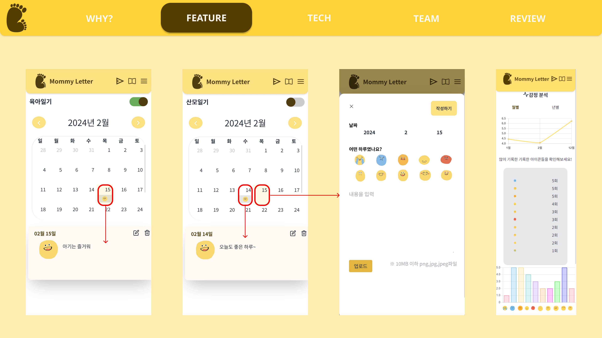
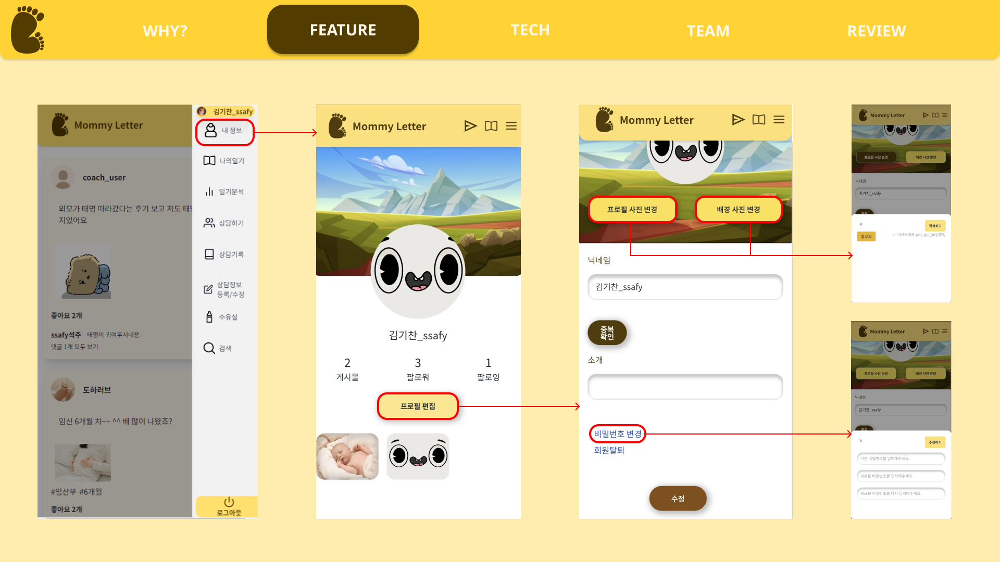
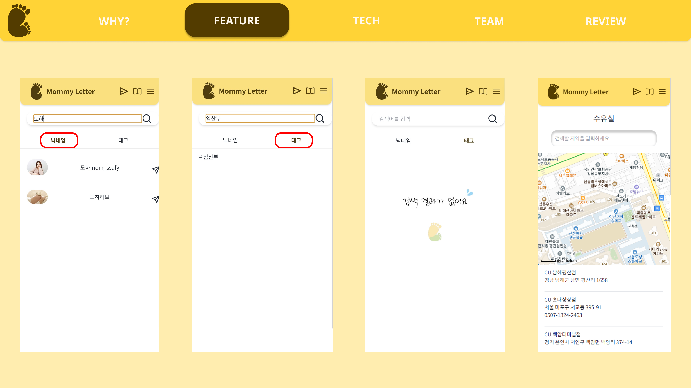

# SSAFY Project : MommyLetter
### 로그인 , 회원가입

### 게시글 피드

### 산모일기, 육아일기

### 프로필

### DM, Follow

### 검색

### 진료/상담 예약 - 사용자

### 진료/상담 예약 확인 - 의사

### 진료 중, 진료 후

------------------

## Built With / 누구랑 만들었나요?

* [고승민](https://github.com/smink112) - 팀장, PM, INFRA, Backend (회원가입, 인증, 프로필, 팔로우, 검색)
* [고석주](https://github.com/seokjugo) - 팀원, Frontend (다이어리(산모,육아), 검색(닉네임,해시태그), 상담, 기록, 의사, 예약, DM)
* [김기찬](https://github.com/TearofCoding) - 팀원, Backend (파일 시스템, 다이어리, 의사, 상담)
* [김도하](https://github.com/KimDohaAcc) - 팀원, Backend (GroupChat, 화상통화, DirectMessage, 게시글, 댓글, 좋아요, 해시태그)
* [정승원](https://github.com/JungSwww1) - 팀원, Frontend (회원가입, 인증, 프로필, 팔로우, 화상통화 ,게시글, 댓글, 좋아요, 해시태그)

------------------

### 개발환경
* jdk 17
* node.js 20.10
* mariaDB (10.6.16-MariaDB)
* mongoDB
* zookeeper 3.8.3
* kafka 2.12-3.6.1